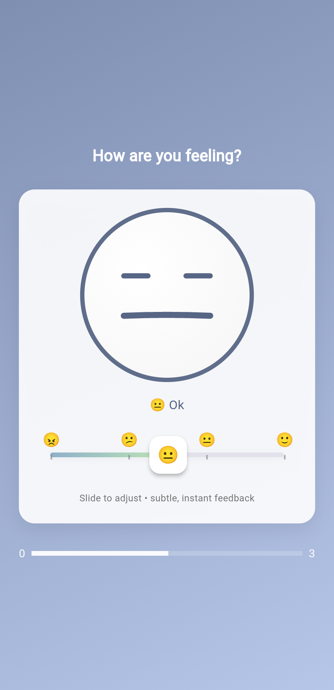

# 😊 Emojies App (Flutter)

A clean and minimal **emoji-based feedback app** built with Flutter.  
This project showcases **interactive UI, smooth emotion transitions, and expressive emoji states** using only the core Flutter SDK.

---

## ✨ Features
- Emoji-based emotion slider
- Real-time emoji facial expression changes
- Smooth color transitions based on emotion
- Clean, modern, and minimal UI
- Single-screen focused user experience

---

## 🎭 Emotion Levels
The app supports four emotion states:
- 😠 Bad
- 😕 Ugh
- 😐 Ok
- 🙂 Good

Each emotion dynamically updates the UI color and emoji expression.

---

## 🛠 Built With
- Flutter (Material 3)
- Dart
- No third-party dependencies